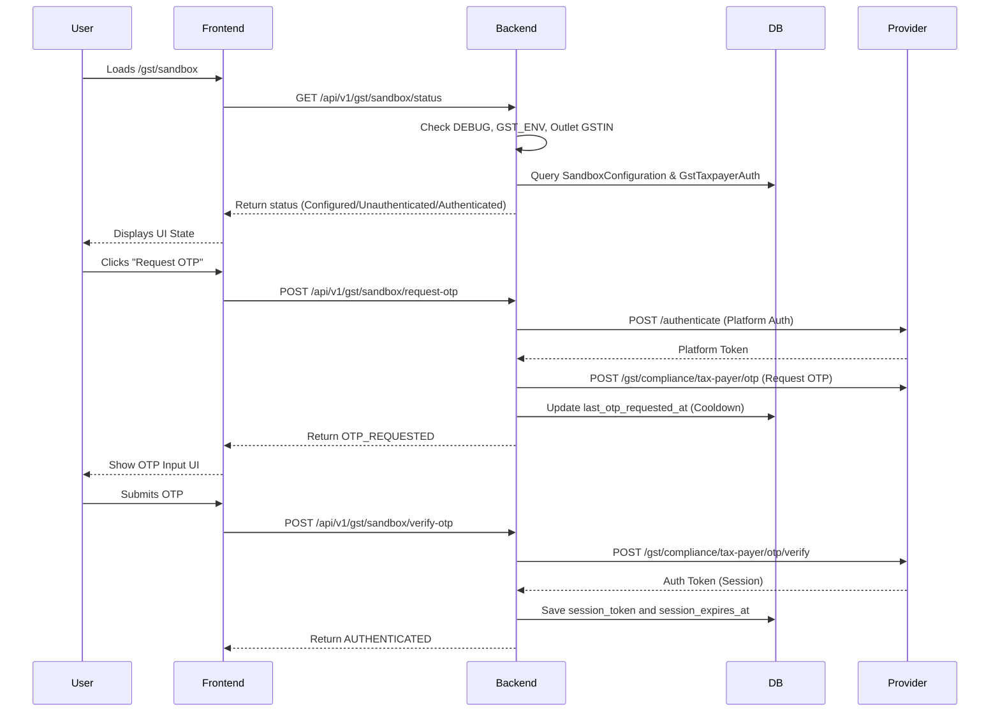

# GST Sandbox Authentication Full Analysis

## 1. Plain-English Summary
The GST Sandbox Authentication feature is designed to allow developers and QA to test the GST return flow (like GSTR-2B syncing) using a secure connection to the `sandbox.co.in` provider, without exposing or touching production data. The backend endpoints are protected by strong guards that completely disable the functionality if the environment is not explicitly configured for local development. Currently, the UI displays "Not Configured" because the backend's strict security guards have automatically blocked access (specifically because `DEBUG=False` and no Sandbox Configuration exists in the database).

## 2. Architecture & Data Flow

## 3. Implementation Map
- **Frontend UI:** `apps/frontend/app/gst/sandbox/page.tsx`
- **Backend Views:** `apps/gst/views.py` (`SandboxStatusView`, `SandboxRequestOTPView`, `SandboxVerifyOTPView`)
- **Core Security Guards:** `apps/gst/views.py::is_sandbox_allowed`
- **OTP Services:** `apps/gst/services/taxpayer_auth.py`
- **Sandbox API Provider:** `apps/gst/provider/sandbox.py` (`SandboxGstProvider`)
- **Database Models:** `apps/core/models.py` (`SandboxConfiguration`, `GstTaxpayerAuth`)
- **Seeder:** `apps/gst/management/commands/seed_gst_sandbox_demo.py`

## 4. Required Database Records
- **Outlet:** `SEED-Mumbai Outlet` must have `state='Maharashtra'`, `state_code='27'`, and `gstin='27AAPCM1753L2ZX'`.
- **SandboxConfiguration:** Must be linked to the above outlet, active, with the provider's `base_url`.
- **User (Staff):** A dedicated sandbox user mapped to the above outlet.
- **GstTaxpayerAuth:** A dynamic record tracking the user's OTP cooldown (`last_otp_requested_at`) and active taxpayer session tokens (`session_token`, `session_expires_at`).

## 5. Environment Variables
- `DEBUG`: **Present** (Value: True) *Note: `DJANGO_SETTINGS_MODULE` is pointing to `prod` inside the container which overrides DEBUG to False.*
- `ENVIRONMENT`: **Missing**
- `GST_ENV`: **Missing**
- `GSTIN`: **Present** (Masked: 27***ZX)
- `GST_USERNAME`: **Present** (Masked: Ma***25)
- `SANDBOX_BASE_URL`: **Present**
- `SANDBOX_API_KEY`: **Present**
- `SANDBOX_API_SECRET`: **Present**
- `GST_API_KEY`: **Missing**
- `GST_API_SECRET`: **Missing**
- `SANDBOX_CLIENT_ID`: **Missing**
- `SANDBOX_CLIENT_SECRET`: **Missing**
- `GST_SANDBOX_TEST_PHONE`: **Present but blank**

## 6. Current Configuration & Cause of "Not Configured"
The UI displays "Not Configured" due to a cascading series of safe blocks:
1. **DEBUG=False:** Inside the docker container, `mediflow.settings.prod` is active, meaning Django runs with `DEBUG=False`. The backend guard `is_sandbox_allowed` immediately denies the request with "Action blocked: DEBUG is false."
2. **Missing `GST_ENV`:** Without `GST_ENV=sandbox` or `GST_ENV=test`, the backend defaults to `prod` and blocks access.
3. **No Database Configuration:** There are `0` `SandboxConfiguration` records in the database.

*The UI message is completely accurate—the backend is enforcing its security rules perfectly.*

## 7. Seed Command Analysis
`apps/gst/management/commands/seed_gst_sandbox_demo.py`
- **Required Env Vars:** `GST_SANDBOX_TEST_PHONE` (cannot be blank), `GSTIN`, `SANDBOX_BASE_URL`, `GST_USERNAME`.
- **Why Phone is Required:** It acts as the primary login identifier for the new sandbox testing user in the custom `Staff` model.
- **Safety:** It is idempotent. It safely ignores production databases. It does **not** change the protected `Test Outlet` or the admin user `9999999999`. It stores no secrets. It makes no external API calls.

## 8. OTP Request / Verification Analysis
- **Status Check:** Read-only. Correctly evaluates active cooldowns and sessions locally.
- **Request OTP:** Securely fetches the platform token (cached) -> Calls sandbox provider -> Enforces a 60-second server-side cooldown.
- **Verify OTP:** Sends the user's OTP to the provider. Returns a session token which is securely persisted in the database.
- **Secrets:** Passwords, OTPs, and Provider Secrets are NEVER printed, logged, or returned to the frontend.

## 9. Security Findings and Risks
The current implementation is highly secure.
- **Guards are Active:** The system refuses to even display sandbox status without explicit `DEBUG=True` and environment variables.
- **No Test User Contamination:** The command actively blocks the `9999999999` user from being re-assigned.
- **Isolation:** GSTR-2B syncing is entirely disabled and blocked on both frontend and backend until a session is legally formed.

## 10. Decision Table

| Finding | Current status | Required action | Can proceed without it? |
|---|---|---|---|
| DEBUG is False | prod settings active | Update `.env` to load `dev` settings and set `DEBUG=True` | No |
| `GST_ENV` missing | Missing | Set `GST_ENV=sandbox` in `.env` | No |
| `GST_SANDBOX_TEST_PHONE` | Present but blank | Provide a valid dummy phone number | No |
| Sandbox Config DB | Missing | Run `seed_gst_sandbox_demo` | No |

## 11. Final Status
**BLOCKED_MISSING_ENVIRONMENT**

## 12. What I need from you
To unblock this flow, please edit the `.env` file (or docker-compose environment) to include:
1. `GST_ENV=sandbox`
2. `ENVIRONMENT=development`
3. `DJANGO_SETTINGS_MODULE=mediflow.settings.dev`
4. `GST_SANDBOX_TEST_PHONE=<any_10_digit_number>` (e.g., `8888888800`)

**Why `GST_SANDBOX_TEST_PHONE` is needed:** This is only used as your login username (phone) for the local MediFlow web application, so you can log in as the sandbox test user. It is **NOT** the phone number where the GST provider will send the actual OTP SMS.
*Reminder: Do not share any real passwords, API secrets, or the OTPs in the chat.*
